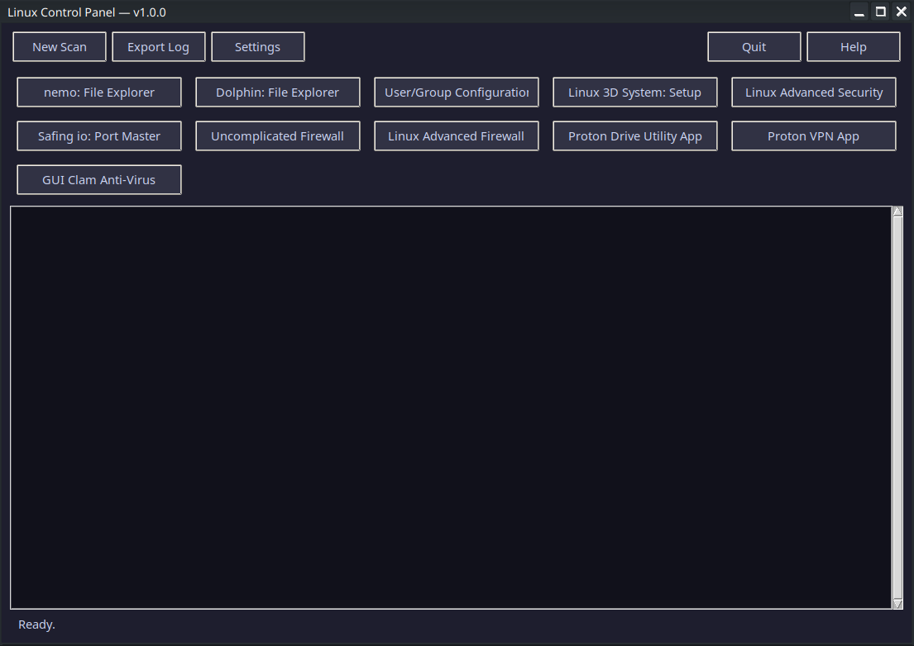
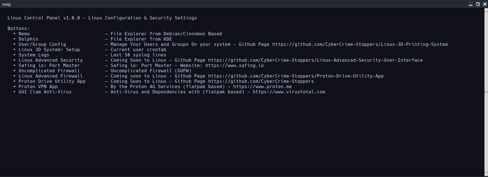

# Linux-Control-Panel
This is a Linux Version of the great Control Panel most of us that grown up with in windowsOS, Linux Control Panel will be a nice &amp; rich to have GUI

support me giving me ideas. developer.on.opensource@unixinbox.com

  #### - Early Stages of the control panel. and the apps that are relevant and also apps that are created off of this GitHub Page
 
 ## Main Page Linux Control Panel.

  >
  >
  
 
